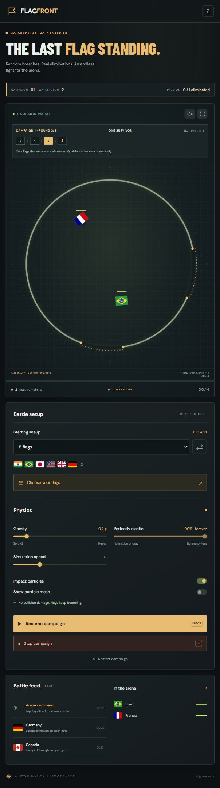

# Flag Battle Royale

A browser game inspired by the supplied Flag Battle Royale HTML. Choose a random or custom lineup of 2–250 countries and territories, then watch flags collide in a rotating-gap arena.

Open **Flag Battle Royale.html** directly for a completely offline, single-file edition. The `dist` folder is the web edition.

[Play the game on Vercel](https://flag-battle-royale-bay.vercel.app).

For a local browser preview, run `python -m http.server 8765 --bind 127.0.0.1 --directory dist` from this folder, then open `http://127.0.0.1:8765/`.

## Controls

- Pause / resume: Space, or the main button. Stop campaign: S, or the Stop button.
- Restart campaign: R. Choose flags: F.
- Search country names or two-letter codes, filter by continent, or paste a comma-separated custom list.
- Lineup choices are remembered on this device when browser storage is available.
- Every lineup starts automatically. Qualifiers advance, and the full selected lineup returns after each champion. Campaigns repeat until paused or stopped.
- Gravity, speed, and particle display can change during play. Collision elasticity is locked at 100%, with no collision damage.

## Endless campaigns

The world stages are **250 → 128 → 64 → 32 → 16 → 8 → 4 → 2 → champion**. Every custom or preset lineup from 2–250 flags uses the same descending power-of-two bracket: for example, five flags play **5 → 4 → 2 → champion**. There is **no round time limit or ranking cutoff**. Only physical gate escapes eliminate flags; each round ends when the exact qualifying count remains.

Gates arm after five seconds. After a random 8–13 seconds, the arena opens two to four rotating gates; random waves change the extra gates every 6–14 seconds. Gate widths vary, and a quiet spell gradually widens real escape routes without removing flags. An already exiting flag continues out even if its gate closes. A target guard prevents simultaneous escapes from eliminating too many qualifiers.

Qualifiers advance after a three-second intermission. After a five-second champion celebration, the original selected countries return with fresh positions, velocities, and gate waves. Pause and Stop freeze combat and all automatic transitions until Resume. Changing the lineup or restarting explicitly begins a fresh campaign. Background tabs continue through a fallback scheduler, subject to browser throttling; closing the page ends the session.

The battlefield interface shows the campaign number, bracket, elimination goal, gate wave, open gate count, and elapsed round time. The progress bar tracks actual eliminations. The activity feed retains its most recent 80 events so endless play does not grow the page indefinitely.

## Simulation

A fixed 120 Hz clock with adaptive substeps uses semi-implicit integration, circle contact impulses, angular motion, positional overlap correction, spatial hashing, and rounded rotating-gap edge contacts. Visible play uses perfectly elastic collision impulses (restitution 1), zero contact friction, zero air drag, zero angular drag, no speed cap, and no collision damage. Adaptive substeps protect fast bodies from tunneling without slowing them down. Gravity and moving gap edges can exchange energy with flags; the collision response itself does not dissipate energy.

Each flag is drawn onto a spring-connected particle grid with shape-restoring forces and inertia, so the cloth flexes independently after collisions. Its visual cloth skin settles independently of the lossless rigid collider. Circular collision hulls protect the deformable flag mesh; this is a game physics approximation, not a full finite-element cloth solver. Eliminated flags break into textured particles. The legacy inelastic engine option remains available only for regression tests, not in the visible controls.

Includes 249 ISO country and territory flags plus Kosovo (250). Flag artwork and country metadata are from [flag-icons](https://github.com/lipis/flag-icons), under its MIT license. See `dist/flag-icons-LICENSE.txt` for attribution.

## Validation and export

Run `node --test tests/physics.test.cjs` for collision, gap, stability, and frame-rate checks. Run `python tools/export_standalone.py` after changing the web edition to refresh the offline file. `tools/prepare_flags.py` refreshes the bundled flags and requires a network connection.

## Vercel deployment

Import this repository into Vercel with framework preset **Other** and the repository root as the root directory. The committed `vercel.json` publishes `dist` directly, with no install or build step. No environment variables are required. A connected GitHub project redeploys when changes are pushed to `main`.
